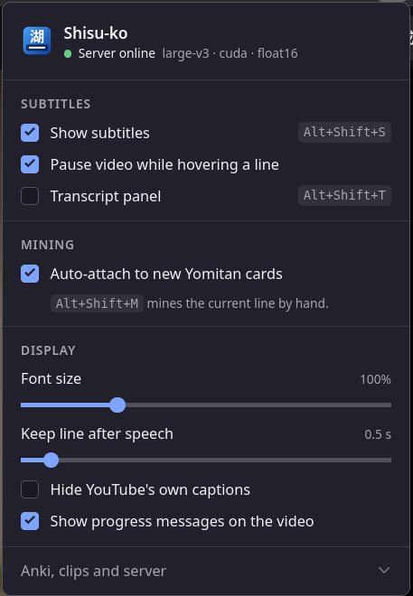

# Shisu-ko

[](https://github.com/Multysquid/shisu-ko/actions/workflows/tests.yml)

Live Japanese subtitles for YouTube in Firefox and Chrome: transcribed on your own machine by Whisper,
readable with [Yomitan](https://yomitan.wiki/), and mined into Anki without pressing a key.


Hover a line and the video waits. Look the word up, add the card, and Shisu-ko fills it with the
frame you were reading and the audio of the sentence. The same recording
[with sound](docs/demo.mp4).

YouTube's Japanese captions are often missing, wrong, or burned into the picture where no
dictionary can reach them. Shisu-ko runs OpenAI's Whisper large-v3 on your GPU, keeps
transcribing a little ahead of where you are watching, and draws the result over the player as
ordinary page text. Everything runs locally: the only network traffic is yt-dlp fetching the
audio from YouTube and the one-time model download.

## What it does

- **Live subtitles**, starting a few seconds after a video opens. The server transcribes ahead
  of the playhead and caches every cue, so seeking back or rewatching is instant.
- **Live streams too** (Firefox). The server follows the stream's audio a little ahead of where
  you are watching, so a stream gets the same subtitles, transcript and mining as a video.
- **Dictionary-friendly text.** Subtitles are real DOM text, so Yomitan or any popup dictionary
  scans them. Hovering pauses the video, the dictionary popup keeps it paused, and moving back
  over the video resumes it.
- **Transcript panel** with every line so far. A timestamp jumps there, a pickaxe mines it.
- **Sentence mining by itself.** The moment Yomitan adds a card, a screenshot and an MP3 clip of
  the whole sentence go into it. The pickaxe on a subtitle or a transcript line, or Alt+Shift+M,
  does the same on demand, into the newest card or into your Downloads folder.
- **Your hardware, your model.** Whisper large-v3 by default. The popup switches to any other
  model without restarting the server: a faster-whisper size or a Hugging Face repo id of a
  CTranslate2 model, such as `kotoba-tech/kotoba-whisper-v2.0-faster` (Japanese-specialised,
  about 6x faster) or a small CPU model. `--model` only sets the default.
- **Native, Nix or Docker.** A one-time setup script on Windows, Linux and macOS, a Nix flake,
  or a container with GPU support. All of them share the same model folder. When the native
  server is not running, a button in the popup starts it (Firefox).

## Requirements

- Firefox 140 or newer, or Chrome 120 or newer.
- For the native server: Python 3.10 or newer on the PATH, plus Node.js 20+ or Deno
  (yt-dlp needs a JavaScript runtime for YouTube). On Nix the flake provides all of this.
- For the Docker server: Docker with the NVIDIA Container Toolkit (Docker Desktop on Windows
  has it built in). The image already contains Deno.
- An NVIDIA GPU with about 4 GB of free VRAM for large-v3. With less free memory the server
  switches to int8 weights by itself; without a GPU use a small model on the CPU.
- Optional: [Yomitan](https://yomitan.wiki/) for lookups, [Anki](https://apps.ankiweb.net/)
  with the [AnkiConnect](https://ankiweb.net/shared/info/2055492159) add-on for mining.

## Quick start

### 1. Start the server

**Windows:** double-click `server\setup.cmd` once, then `server\run.cmd`.
**Linux/macOS:** `bash server/setup.sh` once, then `server/run.sh`.

Setup creates an isolated Python environment in `~/.shisu-ko/venv` and installs faster-whisper,
yt-dlp and the CUDA runtime libraries; nothing else on the system is touched. The first start
downloads the Whisper large-v3 model (about 3 GB) into `~/.shisu-ko/models`. The server is ready
when it prints `Listening on http://127.0.0.1:8790`. Keep the window open while you watch; it
restarts itself if it ever crashes.

From then on the toolbar popup can start it for you: while the server is offline, the status
line in the popup's header shows a **Start server** button. The first click asks Firefox for
permission to "exchange messages with programs other than Firefox"; allow it, and the button
launches `server\run.cmd` in a window of its own (Windows) or `server/run.sh` in the background
with its output in `~/.shisu-ko/server.log` (Linux/macOS), then waits for the server to answer.
The button passes no options: the server starts with its defaults (large-v3, the GPU when there
is one, no cookies), exactly as a bare `run.cmd` / `run.sh` start would. The popup's model
field switches the model once that default one is up; anything else you usually append to
`run.cmd` / `run.sh` (`--device cpu`, `--cookies-from-browser`, `--js-runtime`, ...) needs a start
by hand, see [Server options](#server-options). Firefox only for now: Chrome wants the installed
extension's id in the launcher's manifest. Docker and Nix users start the server as before.

Setup registers that launcher with Firefox, and so does every `run.cmd` / `run.sh` start. An
existing install therefore gets the button after one or two starts by hand: the start that
updates Shisu-ko to a version with the button still runs the old launcher, so it is the start
after the update that registers; running `setup.cmd` / `setup.sh` once is the sure way, and
`run.cmd --check` says whether the launcher is registered. To take the registration away again,
for example before deleting the checkout or if Firefox should not be able to start anything, run
`~/.shisu-ko/venv/Scripts/python server/native_host.py --unregister` (`venv/bin/python` on
Linux/macOS; any Python 3 works, the host is standard library only). It removes
`~/.shisu-ko/native-messaging/shisuko.json` and the `HKCU\Software\Mozilla\NativeMessagingHosts\shisuko`
registry key on Windows, `~/.mozilla/native-messaging-hosts/shisuko.json` on Linux and
`~/Library/Application Support/Mozilla/NativeMessagingHosts/shisuko.json` on macOS; delete
those by hand if the checkout is already gone. `--status` shows the current state.

Every start first looks for a newer Shisu-ko: a git clone is fast-forwarded to the branch it
tracks, a folder downloaded as a zip is replaced with the newest release, changed Python
requirements are installed, and a changed extension is pointed out (reload it in Firefox or
install the new `.xpi`). Local changes are never overwritten, and being offline just starts
the current version. `run.cmd --no-update` (or `SHISUKO_NO_UPDATE=1`) skips the check.

**Nix / NixOS:** `nix run github:Multysquid/shisu-ko` (or `nix run .` in a checkout) starts the
server with CUDA support; `nix run .#check` prints diagnostics; `nix develop` opens a shell with
Python, web-ext, Node and Deno for development. The flake takes CTranslate2 with CUDA from the
`cache.nixos-cuda.org` binary cache, so add it to your substituters or expect a long build. To
keep the server running in the background: `systemd-run --user --unit=shisu-ko nix run /path/to/shisu-ko`.

**Docker:** copy `.env.example` to `.env`, set `DATA_DIR` to where models and caches should
live, then run `docker\up.cmd` (Windows) or `docker compose up -d`. See [Docker](#docker) below.

### 2. Install the extension

Temporary install (until Firefox restarts):

1. Open `about:debugging#/runtime/this-firefox`.
2. Click **Load Temporary Add-on…** and choose `addon/manifest.json`.
3. Firefox asks for access to youtube.com the first time you open the popup; click **Allow on
   YouTube** (or right-click the toolbar icon > Always Allow on www.youtube.com).

Permanent install: download the signed `shisu_ko-<version>.xpi` from the
[latest release](https://github.com/Multysquid/shisu-ko/releases/latest) and open it in Firefox.
Regular Firefox only keeps signed add-ons; the release workflow signs each tagged version
through addons.mozilla.org (unlisted channel, nobody else sees it), and `sign-addon.cmd` does
the same for a local build with a free
[addons.mozilla.org API key](https://addons.mozilla.org/developers/addon/api/key/). Firefox
Developer Edition, Nightly and ESR can instead load the unsigned zip with
`xpinstall.signatures.required` set to `false` in `about:config`.

Chrome development uses the same source. Run `npm ci` and `npm run build:chrome`, then open
`chrome://extensions`, enable Developer mode, and choose **Load unpacked** on `dist/chrome`.
After edits, run `npm run watch`; reload the extension on that page and reload the YouTube tab.
The Firefox source remains directly loadable from `addon/manifest.json`. `npm run build` writes
both unpacked trees and `dist/shisu-ko-<version>-{firefox,chrome}.zip`. For a Chrome release,
download `shisu-ko-<version>-chrome.zip` from the [Chrome release](https://github.com/Multysquid/shisu-ko/releases/latest),
unzip it, and choose **Load unpacked** on the extracted folder. This ZIP is unsigned and is not a
Chrome Web Store install; it has no automatic updates. Keep the extracted folder and reload the
extension from `chrome://extensions` after updates. Chrome shortcuts are under
`chrome://extensions/shortcuts`.

### 3. Watch

Open any YouTube video. The badge in the top-left corner of the player goes from "Fetching
audio…" through "Decoding audio…" to "Transcribing…", and the first subtitles appear after a few
seconds. From then on the server stays ahead of you. The toolbar popup holds every setting, and
the switch in its header turns the whole extension off and on again.

| Shortcut | Action |
|---|---|
| Alt+Shift+S | Turn Shisu-ko on or off (the switch in the popup header) |
| Alt+Shift+L | Toggle the transcript panel |
| Alt+Shift+M | Mine the current sentence (screenshot + audio) |
| ← / → | Jump to the previous / next subtitle. Left replays the current line once you are more than a second into it. Can be turned off in the popup |

Shortcuts can be changed in Firefox under Add-ons and themes > Manage Extension Shortcuts, or in
Chrome at `chrome://extensions/shortcuts`.

## Reading with Yomitan

Hover a subtitle and the video pauses while the pointer is on the text. Scan words with Yomitan
as usual: when the pointer moves into Yomitan's popup the video stays paused, and it resumes
about a third of a second after the pointer comes back over the video. Space or the play button
resume it too. The transcript panel is plain text as well, so earlier lines can be looked up,
and its timestamps seek the video.

## Sentence mining

Mining captures two things for the sentence you are looking at: a screenshot of the video frame
and an MP3 clip of the sentence audio, cut from the original track with a little padding on both
sides. A long sentence is shown as several short subtitle lines, but mining always works on the
whole sentence: the clip spans it, and the card's sentence field is grown from the single line
Yomitan copied to the full sentence, keeping the bold around the word you looked up.

Both are prepared while you watch. Each line that plays has its frame and its clip made ready in
the background, so making a card attaches them at once, and still attaches them after the line has
gone from the screen. Nothing is written to disk; a handful of recent sentences are held in memory
and dropped when you leave the page.

**Anki (default).** Normally you never trigger mining at all:

1. Hover the subtitle; the video pauses.
2. Scan the word with Yomitan and click its **+** (Yomitan fills word, reading, sentence and
   glossary from its own template).
3. Within a second Shisu-ko notices the new card and uploads `shisuko_<video>_<time>.jpg` and
   `.mp3` to Anki's media folder, writing `` and `[sound:...]` into the fields. A
   toast on the player confirms it. The screenshot is the frame that was on screen when you
   hovered the line, and playback is left alone so you can keep reading the popup.

The card is matched to the line it is about. Shisu-ko compares the card's sentence and word
against the transcript rather than assuming you looked up whatever is on screen now, so a card
made a few lines later, or while the video kept playing, still gets the right frame and the right
audio. A card that matches no subtitle is left alone and says so.

Shisu-ko only touches a card that appeared while you were watching, one card at a time, and only
when the card's sentence matches the subtitle, so an import, a sync or a card made elsewhere is
never overwritten. When it cannot reach Anki it stays quiet and writes nothing. Turn the watching
off with **Auto-attach to new Yomitan cards** in the popup; the shortcut and the pickaxe keep
working either way and attach to the newest card added today.

To mine by hand instead:

- hover the subtitle and click the pickaxe that appears at its right edge,
- press Alt+Shift+M while watching,
- click the pickaxe on any line in the transcript panel (the video briefly jumps to that line to
  grab the matching frame, then jumps back).

The first time, Anki shows a dialog asking whether to allow the extension; click **Yes**. Field
names default to `Picture` and `SentenceAudio`, as used by common Japanese mining note types;
change them in the popup to match yours. An optional sentence field is filled with the subtitle
text only when it is empty, so it never overwrites what Yomitan wrote. An optional word field
names the field holding the expression, used to tell two similar lines apart; left empty, the
note's first field is read. If Anki is not running,
mining by hand saves the files to Downloads instead (can be turned off).

**Downloads.** With **Send screenshot and audio to** set to Downloads, the files land in
`Downloads/shisu-ko-mining/`, ready to drag into any card.

DRM-protected videos block screenshots; the audio clip still works. The Shisu-ko server uses
port 8790 precisely so that AnkiConnect can keep its default 8765.

## Live streams

A live stream has no audio track to download, so the server fetches the stream's audio segments
one by one instead, starting just behind where you are watching and then keeping pace with the
live edge, and transcribes each stretch of new audio as it arrives. YouTube's player normally
plays 10-40 seconds behind the live edge, which is the head start the transcription needs; on a
low-latency stream the subtitles can trail the sound by a few seconds. The extension reads the
stream's own clock from the player, so the cues stay aligned whatever your latency is and after
seeking back into the stream. That clock is read from the player through Firefox's
`wrappedJSObject`, which Chrome does not have, so live streams are Firefox only; videos work
in both browsers.

The last 15 minutes of audio stay in memory for seeking back and for mining. Live cues are not
cached, because the recording YouTube publishes afterwards runs on a different clock; when a
stream ends and comes back as a video, Shisu-ko starts over on the video's clock. Streams with
DVR disabled cannot be followed, since the server needs the numbered audio segments.

## Settings



The switch in the header is the master switch. Off means nothing happens on YouTube pages: no
overlay, no requests to the server, no Anki watching and no key handling, until it is switched
on again (Alt+Shift+S flips it too). The status line beside the switch says whether the server
answers, and with which model and device; while it does not answer, a **Start server** button
on that line launches it with the server's default options (Firefox, see
[Start the server](#1-start-the-server)); the model field below takes effect once it is up. The
same page opens as the add-on's preferences under Add-ons and themes > Shisu-ko.

| Setting | Meaning |
|---|---|
| Pause video while hovering a line | Needed for comfortable Yomitan lookups |
| Left/Right jump between subtitles | Arrow keys move between cues instead of seeking five seconds |
| Transcript panel | List of all cues so far, with jump and mine buttons |
| Auto-attach to new Yomitan cards | Watches AnkiConnect and fills the new card by itself; off means Alt+Shift+M or the pickaxe |
| Font size, keep line after speech | Presentation; the linger time keeps short lines readable |
| Hide YouTube's own captions | Avoids two subtitle layers |
| Show progress messages on the video | The status badge; errors are always shown |

Subtitle style lives in its own drawer. The screenshot shows mincho, a raised position, a lighter
box, an outline, and the transcript docked left:


| Style setting | Meaning |
|---|---|
| Height above the bottom | Where the subtitle box sits, 2-40% of the player height; it still drops when YouTube's controls fade out |
| Font | Gothic (the default stack), Gothic bold, Rounded or Mincho, for the subtitle and the transcript |
| Font family | Any font installed on this computer, by name. It goes in front of the preset's stack, so the preset stays the fallback and still decides the weight. The popup previews the result and says whether the name resolved; Firefox cannot list installed fonts, hence the suggestions instead of a menu |
| Text colour | Colour of the subtitle text |
| Background | Opacity of the black box behind the text, 0-100% |
| Outline the text | Black outline instead of the box; readable over bright video with the background turned down |
| Transcript panel side | Docks the panel right or left; the subtitle moves out of its way |
| Reset style | Restores the seven settings above and nothing else |

The **Transcription model** drawer picks the Whisper model the server runs. The field takes a
faster-whisper size (`large-v3`, `large-v3-turbo`, `distil-large-v3`, `medium`, `small`, ...)
or the Hugging Face repo id `owner/name` of a CTranslate2 model
(`kotoba-tech/kotoba-whisper-v2.0-faster`); empty means the server's own `--model`, which the
placeholder shows. Models already downloaded are offered as suggestions. The change applies while
a video plays: a model that is not on disk yet is downloaded from Hugging Face first, while the
current model keeps subtitling, and once the swap is done the video's transcript starts over with
the new model. Meanwhile the badge on the video says "Loading model X…"; a name the server cannot
use shows "Shisu-ko: model X: …" with the reason, even with progress messages off, and the previous
model keeps running. The popup mirrors this under the field: the status badge says "Loading model"
during a switch, and the hint under the field carries the server's verdict on the name you typed.

The last drawer, **Anki, clips and server**, holds where mined material goes (Anki's newest
card or the Downloads folder, with an optional Downloads fallback when Anki is unreachable), the
AnkiConnect URL, the image, audio and sentence field names, the audio padding around the
sentence, the clip format (MP3 or WAV) and the Shisu-ko server URL (default
`http://127.0.0.1:8790`).

## How it works

```
Firefox (addon/)                                 Local server (server/), http://127.0.0.1:8790
+----------------------------------+             +------------------------------------------------+
| content script on youtube.com    |  POST /sync | 1. yt-dlp downloads the audio track once       |
|  - video id, playhead, model 1x/s| ----------> |    (a live stream: follows its audio segments) |
|  - renders cues as DOM text      | <---------- | 2. PyAV decodes it to 16 kHz mono              |
|  - hover pauses, Yomitan scans   |   new cues  | 3. Silero VAD + faster-whisper transcribe      |
|  - screenshot via <canvas>       |  GET /clip  |    windows at the playhead, then ahead of it   |
+----------------------------------+ ----------> | 4. /clip cuts sentence audio from the source   |
        |                                        +------------------------------------------------+
        | AnkiConnect (http://127.0.0.1:8765): storeMediaFile + updateNoteFields on the newest card
        v
      Anki
```

Why a local server instead of running the model in the browser: Whisper large-v3 has 1.5
billion parameters and needs a GPU, which a browser extension cannot use well. The extension
therefore only sends the video id, the current playhead and the wanted model once per second,
and the server does the heavy lifting with
[faster-whisper](https://github.com/SYSTRAN/faster-whisper) (CTranslate2).

**Scheduling.** When you open a video the server fetches the audio track with
[yt-dlp](https://github.com/yt-dlp/yt-dlp), decodes a minute around the playhead while the
download is still running, and transcribes a short 20-second window there so the first subtitles
appear quickly. It then continues in 40-second windows up to 15 minutes ahead of you. A sentence
cut at a window edge is dropped and re-transcribed at the start of the next window, so lines are
never chopped. Seeking to an untranscribed part starts a new short window there.

**Cues.** The server runs Silero voice activity detection on each window and drops what Whisper
makes up over silence and music: segments without words, segments that barely overlap detected
speech, repetition loops and a short blocklist of known hallucinated phrases. Whisper's word
timestamps then split the rest into subtitle-sized cues at sentence ends, long pauses and a
character and duration limit; starts snap to the onset of speech, ends get a short lead-out into
the following silence, fragments are merged and gaps under half a second are closed. The
reasoning and the measurements behind these rules are in
[docs/subtitle-quality.md](docs/subtitle-quality.md). Cues are saved per video and per model in
`~/.shisu-ko/cache`, so a video you have watched before shows subtitles immediately: the
current model's cues are `<video_id>.cues.json`, and when you switch models another model's
cues are kept beside it and come back the moment you switch back.

## Server options

Append options to `run.cmd` / `run.sh`, or put them in the `command:` line of `compose.yaml`.
The popup's **Start server** button runs `run.cmd` / `run.sh` without any of them, so it always
starts the defaults below (the model can still be switched from the popup afterwards); a server
that needs `--device cpu`, cookies or another option is started by hand.

| Option | Effect |
|---|---|
| `--model kotoba-tech/kotoba-whisper-v2.0-faster` | Default model (here the Japanese-specialised distilled one, about 6x faster and lighter on memory than large-v3). The popup overrides the default with any faster-whisper size or Hugging Face repo id, without a restart |
| `--model large-v3-turbo` | OpenAI's faster large model as the default |
| `--model small --device cpu` | CPU-only operation |
| `--compute-type int8_float16` | Halves GPU memory use; chosen by itself when less than 4.5 GB is free |
| `--cookies-from-browser firefox` | Age-restricted or members-only videos, or when YouTube asks for a sign-in |
| `--cookies /path/cookies.txt` | Same, with an exported cookies file (use this inside Docker) |
| `--lookahead 0` | Transcribe to the end of the video instead of stopping 15 minutes ahead |
| `--window 60` | Longer windows are slightly more efficient, shorter ones react faster to seeking (default 40) |
| `--max-cue-chars 26` | Characters per cue before it is split (default 30; 26 is the Netflix Japanese limit) |
| `--max-cue-seconds 6` / `--min-cue-seconds 0.8` | Longest and shortest cue; shorter ones are extended or merged |
| `--initial-prompt "こんにちは。今日は、いい天気ですね。"` | Nudges Whisper towards punctuated output |
| `--idle-minutes 30` | Release the decoded audio of a video nobody has synced for this long |
| `--retry-after 30` | Seconds before a failed audio fetch is retried, and the wait before a model name that failed to download or load is tried again |
| `--js-runtime deno` | JavaScript runtime for yt-dlp: auto, node, deno, bun, or name:path |
| `--allow-remote-ejs` | Lets yt-dlp fetch updated YouTube challenge-solver scripts from GitHub |
| `--check` | Print environment diagnostics (CUDA, yt-dlp's JavaScript runtime, downloaded models, whether the popup's Start button has its launcher registered) and exit |
| `--no-update` | Start without looking for a newer version of Shisu-ko first (`run.cmd` / `run.sh`) |

Endpoints, for anyone building on the server: `GET /health` (`model`, `default_model`,
`model_loading`, `model_error` as `{model, error, names}` or null, where `names` lists every
spelling of the failed model (aliases and repo id), `models` with the models downloaded so far,
device, compute type, language), `POST /sync` (`{video_id, url, t, paused, since, model}`
returns new cues and covered ranges plus `model` (the loaded one), `model_loading` (the name being
prepared or swapped in) and `model_error`, the last judged for the name this request asked for
and null for any other; a model switch answers with a new session token, so the client starts
over; for a live stream `t` is the stream's media clock, `getProgressState().current` in
YouTube's player, and the reply carries `live: true`), `GET /clip?video_id=&start=&end=&format=mp3|wav`,
`GET /sessions` for debugging. The server only listens on 127.0.0.1 and answers browser requests
only from the extension itself or from pages served on this machine, so an arbitrary website
cannot drive downloads and transcription. A model name is validated (a size alias or
`owner/name`, never a path) and resolved through faster-whisper's own download before anything
is loaded, so a request can never point the server at a local folder.

## Docker

```
docker\up.cmd      build (first time) and start in the background; restarts after crashes
docker\logs.cmd    follow the server log
docker\down.cmd    stop
```

On Linux/macOS use `docker compose up -d`, `docker compose logs -f`, `docker compose down`.
Settings live in `.env` (copy `.env.example`): `DATA_DIR` is the host folder for models and
caches and `WHISPER_MODEL` the default model; the popup can switch the container to another
model, which is downloaded into `DATA_DIR`. Point `DATA_DIR` at the native setup's `~/.shisu-ko`
to share the downloaded models. `compose.cpu.yaml` is a CPU-only variant.

The image is `python:3.12-slim` plus the pip-installed CUDA libraries and Deno, about 2 GB. The
GPU driver comes from the host through the NVIDIA Container Toolkit. Two ways to get that on
Windows:

- **Docker Desktop** with the WSL 2 backend (GPU support is built in).
- **Docker Engine inside WSL 2**, without Docker Desktop: run once
  `wsl -d Ubuntu -u root -- bash -c "tr -d '\r' < /mnt/c/<path to this folder>/docker/install-docker-wsl.sh | bash -s -- <your WSL user>"`.
  The `docker\*.cmd` wrappers detect which of the two is installed. Do not run both.
  WSL stops a distro a few seconds after its last session closes, which would take Docker and the
  server down with it, so `up.cmd` opens a minimized "Shisu-ko WSL keep-alive" window; leave it
  open while you watch, and close it (or run `down.cmd`) when you are done.

The extension does not change between native and Docker; both listen on `127.0.0.1:8790`.

## Troubleshooting

| Symptom | Fix |
|---|---|
| No subtitles until the toolbar icon is clicked | Firefox has not granted access to youtube.com yet. Open the popup and click **Allow on YouTube**. |
| Nothing happens on YouTube at all | Check the switch in the popup header; Alt+Shift+S may have turned Shisu-ko off. |
| Badge says "Shisu-ko server offline" | Start `server\run.cmd` or `docker\up.cmd`, or click **Start server** in the popup. Check the server URL in the popup. |
| **Start server** says "launcher not registered" | Run `server\setup.cmd` (Windows) or `bash server/setup.sh` once, or start the server by hand once: `run.cmd` / `run.sh` register the launcher with Firefox on every start. `run.cmd --check` prints "Start button launcher: registered at …" once it is. |
| **Start server** says "Allow Shisu-ko to talk to its launcher …" | Firefox's permission prompt was declined. Click the button again and allow "Exchange messages with programs other than Firefox"; the permission is also under Add-ons and themes > Shisu-ko > Permissions and data. |
| **Start server** says "No answer from the server after 90 s" | The launch did not lead to a listening server, or the server is still downloading or loading its model: the button starts the defaults, so a first start downloads large-v3 (3 GB), and a CPU load takes minutes. Look at the server window (Windows) or `~/.shisu-ko/server.log` (Linux/macOS) before clicking again; clicking again while it loads is harmless, the launcher reports it as already starting. If the server is up but the popup still says offline, the server URL under Anki, clips and server points elsewhere. |
| Server says "Another server is already starting or running on port 8790 (it holds ~/.shisu-ko/server-8790.lock). Stop it first." and stops (exit code 2) | A second server was started while one is loading or running: `run.cmd` double-clicked twice, or a start by hand while a server the popup launched is still in its update check (the **Start server** button itself looks at the lock first and reports a loading server as already starting). Close the window and let the first one finish; it holds the lock until it exits, and the file needs no cleaning up. If no server is running and the message persists, a stale `server.py` process still holds it; end that process (Task Manager, `pkill -f server.py`). |
| First start sits at "Loading Whisper model" for a long time | The 3 GB download runs at your connection speed. Hugging Face's xet transfer mode is disabled because it stalled on Windows; set `HF_HUB_DISABLE_XET=0` to try it. |
| "Loading model X…" stays on the video for a long time | A model picked in the popup is downloaded first, at your connection speed (large-v3 is 3 GB, small about 500 MB); the current model keeps subtitling meanwhile, and the transcript starts over once the new one is in. The popup's status line follows along. |
| "Shisu-ko: model X: unknown model size" or "… was not found on Hugging Face" | The name in the popup's Transcription model field is not a faster-whisper size or an existing `owner/name` repo. Fix the name there; the previous model keeps running meanwhile. |
| "Shisu-ko: model X: … not a CTranslate2/faster-whisper model" | The repo holds a PyTorch checkpoint, not converted weights. Convert it with `ct2-transformers-converter`, or pick a `*-ct2` or `faster-whisper` repo of the same model. |
| Server log says it has no model left and exits with code 3 | A switch failed and the previous model could not be reloaded either (usually GPU memory). The launcher restarts the server on its `--model`; fix or clear the name in the popup. |
| Popup says "X was not found on this computer; the preset is used" or that a font name is letters, digits, spaces, dots, hyphens and underscores | Install the font, or type its family name exactly as the operating system lists it. Quotes, commas and other punctuation are refused; in both cases the preset font applies until the name resolves. |
| "yt-dlp needs Node.js or Deno" | Install [Node.js](https://nodejs.org/) 20+ or [Deno](https://deno.com/), then restart the server. |
| "YouTube asks for a sign-in" | Restart with `--cookies-from-browser firefox` (native) or `--cookies /data/cookies.txt` (Docker). |
| Downloads fail after a YouTube update | Update yt-dlp: `~/.shisu-ko/venv/Scripts/python -m pip install -U yt-dlp` (Windows) or the `bin/python` equivalent; or start with `--allow-remote-ejs`. |
| "This live stream offers no audio segments (DVR may be disabled)" | The streamer turned DVR off. Nothing can be done until the stream is published as a video. |
| "The live stream has ended" | Reload the page once YouTube shows the recording; the server starts over on the video's clock. |
| Server says "Only N MiB of GPU memory is free" or restarts by itself | Other programs (games, Wallpaper Engine, VR software) hold most of the VRAM. The server switches to int8 weights; with under about 2.5 GB free the display driver can reset under load (Windows logs LiveKernelEvent 141). Close GPU-heavy apps or type `kotoba-tech/kotoba-whisper-v2.0-faster` into the popup's model field. Cached cues survive restarts. |
| CPU fallback, transcription far too slow | `run.cmd --check` should list one CUDA device; update the NVIDIA driver or type `small` into the popup's model field. |
| Mining says "AnkiConnect denied access" | Click **Yes** in the dialog Anki shows, then mine again. |
| Mining says the card has none of the fields | Set the image/audio field names in the popup to the fields of your note type. |
| No screenshot, only audio | The video is DRM-protected; the browser refuses to read its frames. |

`run.cmd --check` prints diagnostics, including whether the Start button's launcher is registered;
`GET http://127.0.0.1:8790/sessions` lists active sessions.

## Limitations

- On a live stream the subtitles can only be as early as the transcription of the audio behind
  the live edge; with YouTube's low-latency setting they may trail the sound by a few seconds.
  Streams with DVR disabled cannot be followed, and live streams work in Firefox only.
- Subtitles are hidden while YouTube plays ads.
- YouTube changes its player regularly; yt-dlp usually needs an update within days.
- Whisper occasionally hallucinates on music or silence; the voice-activity gates remove most of
  it but not all.

Planned: a distilled, smaller Japanese model that could eventually run in the browser itself.

## Development

```
addon/                Firefox extension (Manifest V3, plain JS, no build step)
  content.js          overlay, sync loop, hover-pause, transcript, live clock, mining trigger
  background.js       server proxy, settings, AnkiConnect watching, Downloads handling, server start
  settings.js         the one place settings and their defaults are declared
  popup.*             settings UI with the server status and Start button, also the preferences page
  tests/              Node tests for background.js, popup.js and the pure helpers of content.js
server/
  server.py           HTTP server: yt-dlp + faster-whisper + live follower + clip cutting
  setup.cmd/.sh       one-time environment setup     run.cmd/.sh   start (with auto-restart)
  update.py           self-update run first by run.cmd/.sh: git fast-forward or newest release
  native_host.py      native-messaging host behind the popup's Start server button (stdlib only);
                      native-host.cmd/.sh wrap it for Firefox; --register writes the host manifest
  tests/              pytest suite                   tools/        cue statistics, re-transcription
docker/               Windows wrappers for docker compose and the WSL engine installer
docs/                 subtitle-quality.md, screenshots, the demo recording, amo/ (store listing)
Dockerfile, compose.yaml, compose.cpu.yaml, .env.example, flake.nix
sign-addon.cmd        signs the extension through addons.mozilla.org for self-distribution
publish-addon.cmd     submits a version to the public listing on addons.mozilla.org
AGENTS.md             architecture notes, invariants and gotchas for contributors and coding agents
```

Checks:

- Extension: `for file in addon/*.js; do node --check "$file"; done`, `npx web-ext lint --source-dir addon`,
  `npx web-ext build --source-dir addon --artifacts-dir dist --ignore-files "tests/**"` (the
  tests folder is not shipped).
- Browser packages: `npm ci`, `npm test`, `npm run build`, `npm run watch`, and `npm run test:browser`.
  `nix build .#addon` and `nix build .#addon-chrome` build the two release packages. Refresh committed PNG
  icons after changing `addon/icons/icon.svg` with `npm run refresh-icons` (ImageMagick required).
- Server: `python -W error -c "import ast; ast.parse(open('server/server.py').read())"`,
  `server/run.cmd --check`. The planning, cue-building and live-follower code is pure and easy
  to unit test by importing `server.py` as a module (register it in `sys.modules` first because
  of the postponed annotations).
- Nix: `nix develop` gives the Python environment, `web-ext`, Node and Deno; `nix run .#tests`
  runs both test suites; `nix build .#addon` produces the extension zip.
- Data lives in `~/.shisu-ko` (override with `SHISUKO_HOME`): `venv/`, `models/`, `cache/`,
  the instance lock `server-8790.lock` (one per port, held while a server runs), `server.log`
  (the output of a server the popup started, Linux/macOS) and, on Windows, the launcher's host
  manifest `native-messaging/shisuko.json`.

Tests cover the pure logic on both sides, need no GPU, network or Firefox, and run in CI on
every push and pull request via [`.github/workflows/tests.yml`](.github/workflows/tests.yml):

```
pip install -r server/requirements-test.txt
python -m pytest server/tests
node --test addon/tests/*.test.js
```

The browser smoke test uses a local fixture page and does not open a real video. The shared
development commands are `npm ci`, `npm test`, `npm run build`, `npm run watch`, and
`npm run test:browser`. Before the first browser test, run `npx playwright install chromium`
(`npx playwright install --with-deps chromium` on Linux). Set `CHROMIUM_PATH` to use an existing
Chromium executable instead. The browser test also runs an isolated AnkiConnect fixture; it does
not change your Anki collection.

The server suite covers window planning, interval merging, cue building and the hallucination
gates, the preview decode, the live-stream buffer and follower (driven by a fake source and
clock), fetch retries, the origin policy, session tokens and the on-disk cue cache.
`test_model_switch.py` drives a model switch with a fake faster-whisper: name validation and
aliases, the download beside the working model, the swap and session restart, every failure path
and cooldown, the per-model cache files and what `/health` and `/sync` report.
`test_native_host.py` drives the native host behind the Start button: the message framing, the
two commands and every malformed request, the launch on each platform with a recorded `Popen`,
the instance lock shared with `server.py`, registration into a temporary home with a fake
registry, the host over a real pipe, and the wrapper and launcher scripts. The extension
suite runs `background.js` and the helpers of `content.js` in a Node `vm` sandbox that stands in
for the WebExtension APIs: settings storage, the server, AnkiConnect and Downloads proxying,
sentence mining, the live clock and the master switch. `content.test.js` also covers the model
name sent with every sync, the restart on a new session token, the model status and error
messages and the font stack; `popup-copies.test.js` keeps the popup's copies of the font and
model-name rules equal to those in `content.js` and `server.py`. `background.test.js` covers
the `startServer` message: the native host's answers, the timeout, the mapping of the browser's
errors to hints, and the launch record that outlives the event page; `popup.test.js` runs the
popup's start flow against a fake document, from the button to the 90 s deadline and its hints.

## Acknowledgements

Built on [faster-whisper](https://github.com/SYSTRAN/faster-whisper) and
[CTranslate2](https://github.com/OpenNMT/CTranslate2), [yt-dlp](https://github.com/yt-dlp/yt-dlp),
[PyAV](https://github.com/PyAV-Org/PyAV), OpenAI's [Whisper](https://github.com/openai/whisper)
and [Kotoba-Whisper](https://huggingface.co/kotoba-tech/kotoba-whisper-v2.0). The mining flow
follows the conventions of [Yomitan](https://yomitan.wiki/), [AnkiConnect](https://foosoft.net/projects/anki-connect/)
and [asbplayer](https://github.com/killergerbah/asbplayer).

## License

MIT, see [LICENSE](LICENSE).
